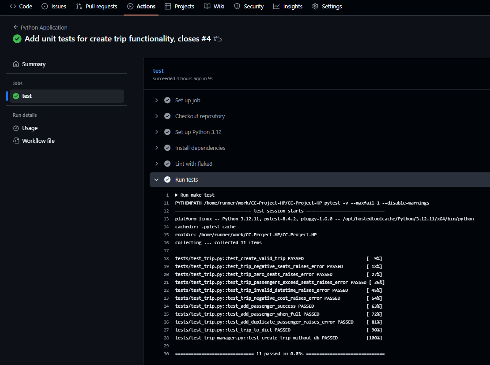

# Milestone 2 – Continuous Integration

Project: BlaBlaTrip – Do Trips Together With Strangers  
Student: Hendrik Pauthner  
Email: pauthner@campus.tu-berlin.de  
Course: Cloud Computing: Fundamentos e Infraestructuras - 25/26  


## 1. Milestone Goals

- Set up Automated Testing and Continuous Integration (CI).
- Choose and justify Choices for Task Manager, Assertion Library, Testing Framework, Build Integration and CI System.
- Implementation and execution of tests to test some part of BlaBlaTrip's business logic.

## 2. Tool Selection for Continuous Integration

The following tools were selected to implement **Continuous Integration (CI)** and automated testing within the project:

| Step                           | Tool   |
| ------------------------------ | ------------------------------ |
| Testing Framework / Runner | pytest                   |
| Assertion Library          | pytest built-in assertions |
| Task Manager             | make (Makefile)     |
| Build Integration         | `make test` target in Makefile |
| CI System                  | GitHub Actions             |


### Pytest
- Go-to testing framework for Python, widely adopted and actively maintained.  
- Naturally suited for **Test-Driven Development (TDD)**, the approach used in this project.   
- While other frameworks might offer additional features, Pytest provides all required functionality for a small-to-medium-sized project like this.


### Make
- Simple and fast build automation configuration through a single `Makefile`.
- Therfore ideal for this small-to-medium-sized project projects without many external dependencies, where no sophisticated setup is needed


### GitHub Actions
- Integrated CI system within GitHub — no external setup required.  
- Automatically triggers workflows e.g. on pushes and pull requests.
- Ensuring consistent results by executing tests in standardized, containerized environments.

---

## 3. Setup Process

### CI System: GitHub Actions

GitHub Actions allows for running tasks (called **workflows**) automatically in response to events in the repository — for example, when someone pushes code or opens a pull request.

For this project, a workflow file named `python-app.yml` has been created at the following location:  

`.github/workflows/python-app.yml`

with the following content:

```yaml
name: Python Application

on:
  push:
    branches: [ main ]
  pull_request:
    branches: [ main ]

permissions:
  contents: read

jobs:
  test:
    runs-on: ubuntu-latest

    steps:
      # Download the repository’s code onto the runner
      - name: Checkout repository
        uses: actions/checkout@v5

      - name: Set up Python 3.12
        uses: actions/setup-python@v6
        with:
          python-version: "3.12"

      - name: Install dependencies
        run: |
          python -m pip install --upgrade pip
          pip install flake8 pytest
          if [ -f requirements.txt ]; then pip install -r requirements.txt; fi

      - name: Lint with flake8
        run: |
          # Stop the build if there are syntax errors or undefined names
          flake8 . --count --select=E9,F63,F7,F82 --show-source --statistics
          # exit-zero treats all errors as warnings; the GitHub editor is 127 chars wide
          flake8 . --count --exit-zero --max-complexity=10 --max-line-length=127 --statistics

      - name: Run tests
        run: make test
```

#### Key aspects:

**Trigger:** Runs automatically on every **push** or **pull request** to the `main` branch.  

**Permissions:** Set to `read` — the workflow cannot modify or delete files in the repository.  

**Runner:** ´Creats **virtual Ubuntu environment** (`ubuntu-latest`), providing a consistent and isolated build setup.

**`actions/checkout` step:** Downloads the repository code onto the runner.  

**`actions/setup-python` step:** Defines and installs the required Python version (3.12 in this case)

**Linting step:** lints Python code with `flake8`

**Testing step:** runs pytest tests by invoking `make test`  


## Make - Task Manager and Build Build:

The Makefile integrates the durchführung of tests into the build process of the project. Right now it just contains a target to run the pytest tests:
```
test:
    PYTHONPATH=$(PWD) pytest -v --maxfail=1 --disable-warnings
```

Later more logic for setting up and building the project will be added.

## Creating first part of business logic and and tests

In this milestone, the first part of the business logic has been implemented — allowing a driver to create a new tour.

At this stage, the focus is on verifying the correctness of the input and output functions. A database for data persistence and integration testing has not yet been implemented.

Four Python files were added: two in `src/` for the business logic and two in `test/` for the corresponding unit tests:
```
├── src/  
|	├── trip_manager.py
|   └── trip.py
├── test/  
|	├── test_trip_manager.py
|   └── test_trip.py
```

**trip.py:**  
Defines the *Trip* domain model with all trip fields and business rules. It validates input, manages passengers and provides serialization.

**trip_manager.py**:  
Implements a service layer to create and persist Trip instances. It re-validates trips, later interacts with a database (if provided) and assigns a unique *trip_id* when saving.

**test_trip.py:**  
Verifies the Trip model’s behaviour:
- Successful creation with valid data
- Validation errors for bad input
- Passenger add logic (including duplicates/full trips)
- Correct *to_dict* serialization

**test_trip_manager.py:**  
Ensures *trip_manager* creates and persists trips, assigns a *trip_id* with or without a DB, etc.

## Testing locally

The created tests can be tested locally by executing make in the project root:
```bash
make test
```
## CI Testing with Github Actions

Due to the GitHub Actions workflow `python-app.yml`, all tests a executed every time GitHub registers a new push or pull request

After Pushing, the results of the tests can be accessed via the *Actions*-tab of the Github Webpage as shown below:



