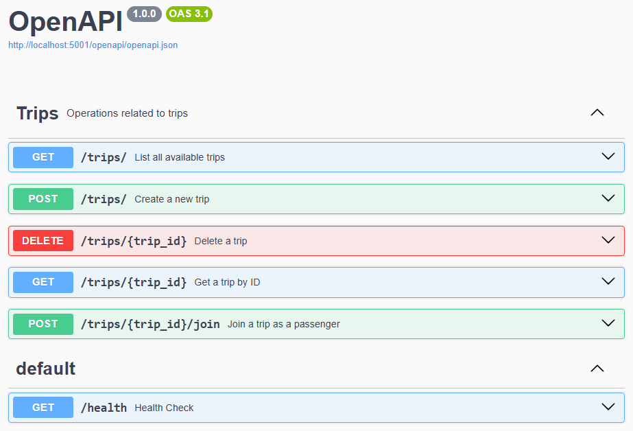
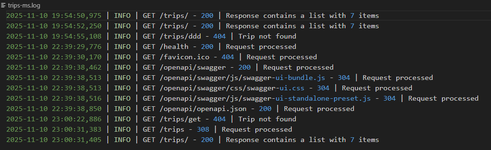

# Milestone 3 – Microservices Design

Project: BlaBlaTrip – Do Trips Together With Strangers  
Student: Hendrik Pauthner  
Email: pauthner@campus.tu-berlin.de  
Course: Cloud Computing: Fundamentos e Infraestructuras - 25/26

## 1. Milestone Goals

- Full implementation of core functionality
- Microservicd design: Design and implementation of API routes and database integration
- Implementation of tests for both layers: business logic / API
- Database Integration
- Implementation of logging system to record API activity

# 2. Fundamental Application Design & Design Principles

All examples and explanations below refer to the **Trips Microservice**.

### Backend Framework

The **Flask** framework was chosen because it is lightweight, reliable, and perfectly suited for the scope of this project.  

More specifically, the project uses **Flask-OpenAPI3**, a wrapper that extends Flask with automatic generation of an OpenAPI specification and integration of **Pydantic models**. This approach provides type safety and improves the robustness of the application.

---

### Pydantic Trip Model

A **Pydantic Trip model** has been defined in the file `trip.py` for the internal handling of trip data within the microservice.

---

### Database

**MongoDB** was selected as the database because it offers high flexibility for storing semi-structured data and scales easily for distributed applications.  
The database connection is initialized in `app.py`, while data handling is implemented in `trip_manager.py`.

---

### API Routes and Models

The REST API endpoints are defined in `routes.py`, which invoke the business logic implemented in `trip_manager.py`.  

The file `api_models.py` contains the **Pydantic data models** used for external communication through the API.

---

### Layered Design

The project follows a **layered architecture** to ensure clean separation of concerns:
- **Application Layer** – `app.py`
- **API Layer** – `routes.py`
- **Business Logic Layer** – `trip_manager.py`

Additionally, data models are separated for:
- **Internal use** (within the Business Logic Layer): `trip.py`
- **External use** (within the API Layer): `api_models.py`

This structure improves maintainability, scalability, and security.

---

### Single Source of Truth and Dependency Injection

Data access is implemented with dependency injection to guarantee a **single source of truth**.  
The database connection is passed as a dependency to the `TripManager` class:

```python
class TripManager:
    """Manages trip creation and storage operations."""

    def __init__(self, db_collection: Optional[Collection] = None, mongo_uri: str = None):
        ...
```

Here, the database handler db_collection is passed as a constructor argument, ensuring flexibility for both runtime use and testing.

# 3. Microservices Build Infrastructure – Docker

Instead of extending the Makefile to manage the complete project setup, **Docker** and **Docker Compose** were integrated directly to handle container orchestration.

As the topic of Dockerization will be discussed in detail in **Milestone #4**, this section highlights only the basic aspects.

Two new files were introduced:

- **Dockerfile** – contains the build instructions for the Flask-OpenAPI3 microservice.  
- **docker-compose.yml** – defines a second container for the **MongoDB** database used by the Trips service. Docker Compose allows both containers to start simultaneously within a shared network, enabling internal communication and external access via port forwarding.


# 4. API Design and Implementation

The **Trips Microservice** exposes the following API endpoints:



These endpoints cover the core functionalities for creating, retrieving, joining, and deleting trips.  
Endpoints for creating and retrieving **trip requests** have not yet been implemented due to time constraints and are scheduled for **Milestone #4**.

For detailed specifications, the **automatically generated OpenAPI documentation** can be accessed through the browser once the application is running (see [README.md](../README.md)).  
This convenient feature is provided by **flask-openapi3**.

All API endpoints include alternate response and error handling where appropriate — for example, returning `"404 – Not Found"` instead of `"200 – OK"` when an entry is missing.

---

# 5. Testing the Business Logic and API Layers

Tests have been refactored and split into **unit** and **integration tests**.

## Unit Tests

- `test_trip.py` and `test_trip_manager.py` contain granular unit tests for the business logic, with several missing cases added.

## Integration Tests

- `test_database.py` tests the database functionality with a mocked MongoDB collection.  
- `test_api.py` performs full integration tests within the **Dockerized environment**, including real API calls and database operations.  
- `conftest.py` provides fixtures for the integration tests:
  - **API Service Fixture:** Starts and stops the Docker Compose services, waiting until the API is online before running tests.  
  - **Database Fixture:** Creates a clean MongoDB collection for each test, ensuring isolation and consistency.

---

# 6. Logging System Implementation

A dedicated **logging microservice** was initially considered, but due to the small size of this project, this approach was deemed unnecessary.  
Instead, the built-in Python **logging** module was used.

To avoid cluttering the code with logging statements in every API route, logging handlers were implemented at the **application level**.  
Flask supports this via decorators such as:

- `@app.after_request` – executed after each request.  
- `@app.errorhandler(Exception)` – triggered for unhandled exceptions.

This design reduces code complexity and ensures centralized logging.

The complete logging setup has been placed in a dedicated module (`shared/logging_config.py`), making it reusable for other Python microservices such as a potential **User Service**.

Logs are saved in `logs/<microservice_name>.log`.

An example log output of the Trips Microservice (`logs/trips-ms.log`) is shown below:



