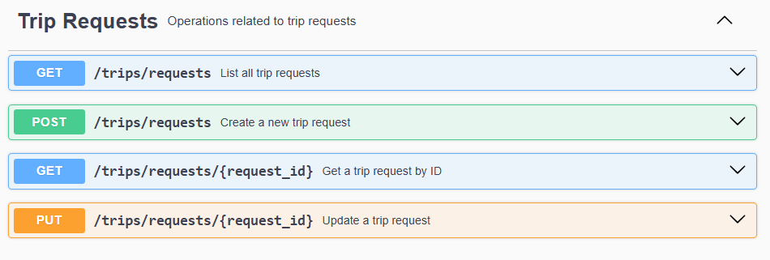
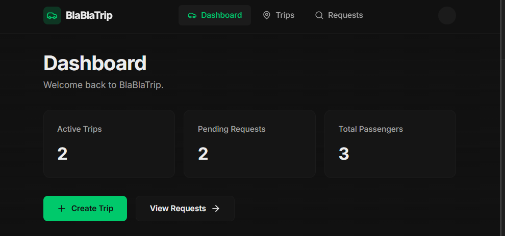
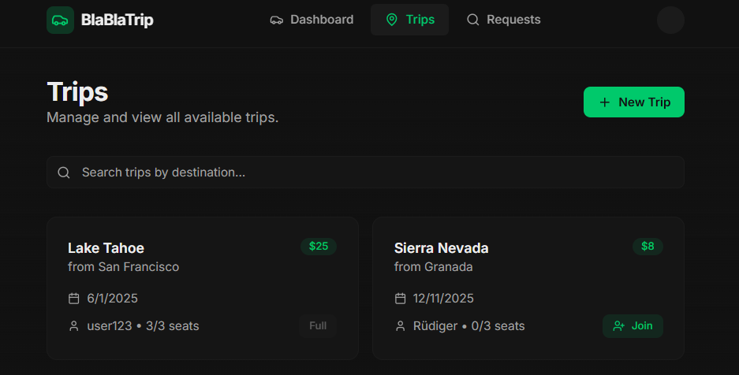
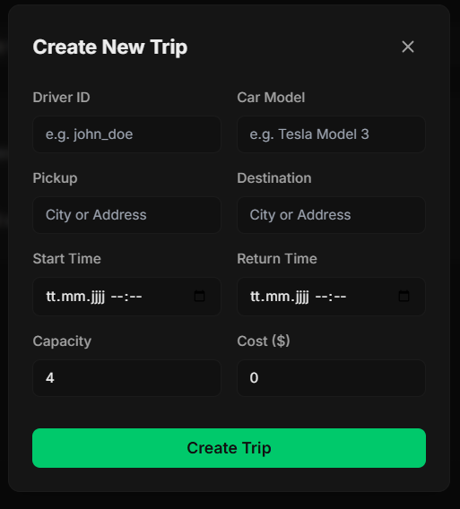
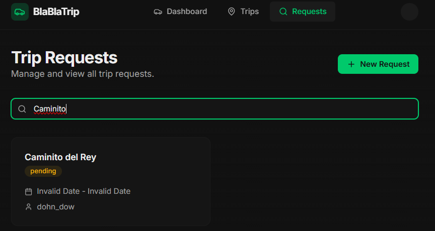
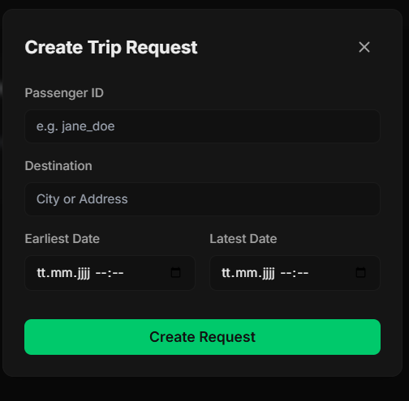
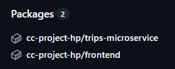

# Milestone 4 – Service Composition

Project: BlaBlaTrip – Do Trips Together With Strangers  
Student: Hendrik Pauthner  
Email: pauthner@campus.tu-berlin.de  
Course: Cloud Computing: Fundamentos e Infraestructuras - 25/26

## 1. Milestone Goals

- Implement trip requests functionality
- Implement basic NextJS Frontend 
- Dockerize Application
  - create Docker images for Frontend and Trip Microservices
  - implement automated contasiner cluster with `docker compose`
  - GitHub workflow for uploading Microservice containers to GitHub Packages
- Implmenets test to verify container cluster is working


## 2. Implementation of Trip Requests Functionality

This addition to the trips microservice serves as a follow-up to Milestone 3. New business logic and API endpoints have been implemented as detailed below:

### Business logic

The following additions to the business logic have been made:

- Definition of a new `TripRequest` Data Model: This includes fields for request_id, passenger_id, destination, status (e.g., 'pending', 'accepted'), an optional trip_id, and timestamps. The file formerly known as `trip.py` has been renamed to `bll_models.py`, and the new model has been integrated there.
- To ensure a clear separation of concerns, a new class `trip_request_manager.py` has been added. It provides methods for creating, retrieving, and updating trip requests.

#### Database Integration:

As shown in the code snippet from `app.py` below, a second MongoDB collection for *"trip_requests"* is now initialized alongside the existing *"trips"* collection. These two collections are then dependency-injected into the instances of `trip_manager` and `trip_request_manager`, respectively:

```python
# Initialize MongoDB client and inject into TripManager
mongo_uri = os.getenv("MONGO_URI", "mongodb://trips-db:27017/trips_db")
mongo_client = MongoClient(mongo_uri)
db = mongo_client.get_database()

trips_collection = db.get_collection("trips")
trip_requests_collection = db.get_collection("trip_requests")

trip_manager = TripManager(db_collection=trips_collection)
trip_request_manager = TripRequestManager(db_collection=trip_requests_collection)
```

#### API Endpoints:

The following API endpoints have been added to the Trips Microservice:



Detailed OpenAPI documentation can be accessed at http://localhost:5001/openapi/swagger.

#### Testing:

The following test files have been added:

- `tests/unit/test_trip_request_manager.py`: Unit tests utilizing a mocked database.
- `tests/integration/test_trip_requests_api.py`: Integration tests running in a dockerized environment with a real database and actual API calls. Further details on this follow below.

## 3. Implementation of Basic Next.js Frontend

A frontend has been implemented using the [Next.js](https://github.com/vercel/next.js) framework, utilizing TypeScript for type safety.
Currently, it includes the following features:
- Overview dashboard
- Trips view with search functionality
- Creation of new trips
- Joining a trip
- Trip Requests view with search functionality
- Creation of new trip requests

The screenshots below illustrate the current state of the listed frontend components:









Since the project now contains not only the Trips Microservice but also the Frontend Microservice, the directory structure has been reorganized. All files related to the Trips Microservice were moved to a newly created `trips/` subdirectory, while the Frontend Microservice resides in the `frontend/` subdirectory.

## 4. Dockerization of the Application

Adhering to the best practice that a single container should serve a single purpose, the application has been dockerized into a cluster of three containers:

1. The Trips Service Container
2. The Trips Database Container
3. The Frontend Service Container


As previously outlined in the Milestone 3 documentation, it was decided not to include an additional container for logging purposes.

#### 4.1 Creation of Docker images

To create the Docker images, two `Dockerfiles` were added to the subdirectories of the respective microservices: `trips/` and `frontend/`.

**Trips Dockerfile**:

```Dockerfile
# Use an official Python runtime as a parent image
FROM python:3.12-slim

# Set the working directory in the container
WORKDIR /app

# Copy the requirements file into the container at /app
COPY requirements.txt .

# Install any needed packages specified in requirements.txt
RUN pip install --no-cache-dir -r requirements.txt

# Copy the rest of the application's code into the container at /app
COPY . .

# Make port 5001 available to the world outside this container
EXPOSE 5001

# Define environment variable
ENV FLASK_APP=src/app.py

# Run app.py when the container launches
CMD ["flask", "run", "--host=0.0.0.0", "--port=5001", "--reload"]

```

During the build process, the Dockerfile executes the following steps sequentially:

1.  The `python:3.12-slim` image is used as the base:
    * This is consistent with the GitHub Actions Testing Workflow, which also utilizes Python 3.12.
    * The "slim" version is sufficient for the project's requirements, resulting in a lighter container and shorter build times.
2.  The `requirements.txt` file is copied to the Docker container and used to install the necessary Python packages to run the microservice.
3.  The rest of the application's code is transferred to the container.
4.  Port 5001 is exposed as the external access point for the microservice.
5.  The environment variable `FLASK_APP=src/app.py` is set so that Flask knows where to locate the application startup code.
6.  Upon successful container setup, the application is started with the shell command:  
    `flask run --host=0.0.0.0 --port=5001 --reload`.  
    The `--reload` flag is particularly useful for development because it allows local code updates to be automatically pushed to a running Docker container. This eliminates the need to manually restart the container.


**Frontend Dockerfile**:
```Dockerfile
FROM node:24-alpine

WORKDIR /app

COPY package*.json ./

RUN npm install

COPY . .

EXPOSE 3000

CMD ["npm", "run", "dev"]
```

The Frontend Dockerfile operates on the same principle as the Trips Dockerfile. Here, `node:24-alpine` is used as the base image because Node.js is the underlying technology for JS/TS frameworks like Next.js, and this version represents the latest stable release.


#### 4.2 Implementation of container cluster with `docker compose`

`docker compose` has been implemented to set up and automate the container cluster described above. Specifically, a layered setup was applied with a base `docker-compose.yml` in the application root directory and a second one in the `trips` subdirectory.

This setup preserves the ability to launch the Trips Service and Database containers separately without the Frontend. This is required for integration testing of the Trips Microservice within the Docker environment, as explained in Section 5.

**Base docker-compose.yml**:
```yml
include:
  - trips/docker-compose.yml

services:
  frontend:
    build: ./frontend
    container_name: frontend
    ports:
      - "3000:3000"
    volumes:
      - ./frontend:/app
      - /app/node_modules
    environment:
      - NEXT_PUBLIC_API_URL=http://localhost:5001
      - INTERNAL_API_URL=http://trips-microservice:5001
    depends_on:
      - trips-microservice
```

* **Include:** Incorporates the configuration from `trips/docker-compose.yml` (Trips Service and Database) into the build process.
* **Image Source:** Builds a Docker image using the Dockerfile located in the `./frontend` directory.
* **Port Mapping:** Exposes port 3000 on the host machine and maps it to port 3000 inside the container, where the frontend runs.
* **Volume Mounts:**
    * Mounts the local `./frontend` directory into the container's `/app` directory (enabling live code changes during development).
    * Creates an anonymous volume for the `/app/node_modules` directory to ensure dependencies built inside the container are prioritized.
* **Environment Variables:** Sets variables to locate the Trips Microservice.
* **Dependency:** Ensures the `trips-microservice` container is started successfully before the frontend container initializes. 
  

**Trips docker-compose.yml**:

Builds the Dockerfiles for the Trips Service and the Trips Database in a similar manner. Database data is persisted using the `mongo-data` volume.
```yml
services:
  trips-microservice:
    build: .
    container_name: trips-microservice
    ports:
      - "5001:5001"
    volumes:
      - .:/app
    environment:
      - FLASK_ENV=development
      - MONGO_URI=mongodb://trips-db:27017/trips_db
    depends_on:
      - trips-db

  trips-db:
    image: mongo:latest
    container_name: trips-db
    environment:
      - MONGO_INITDB_DATABASE=trips_db
    ports:
      - "27017:27017"
    volumes:
      - mongo-data:/data/db

volumes:
  mongo-data:
```


#### 4.3 Automated Docker Image Upload to GitHub Packages

A new GitHub Actions Workflow (`publish-containers.yml`) has been added to automatically push the Trips and Frontend Service Docker images to GitHub Packages every time a push is made to the repository.

The uploaded images are accessible on GitHub on the right side of the code dashboard under "Packages":



---
## 5. Integration Testing full container cluster

The following integration test files were created to verify the functionality of the container cluster:

-   `test_trips_api.py`: Performs full integration tests within the **Dockerized environment**, including database operations and API calls related to Trips.
-   `test_trip_requests_api.py`: Performs full integration tests within the **Dockerized environment**, including database operations and API calls related to Trip Requests.
-   `conftest.py`: Provides fixtures for the two integration test files:
    -   **API Service Fixture:** Starts and stops the Docker Compose services, waiting until the API is online before running tests.
    -   **Database Fixture:** Creates a clean MongoDB collection for each test, ensuring isolation and consistency.