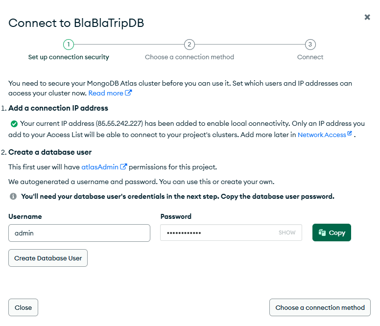
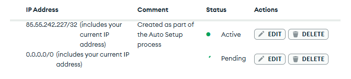
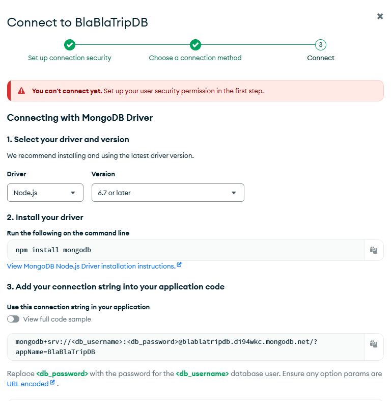
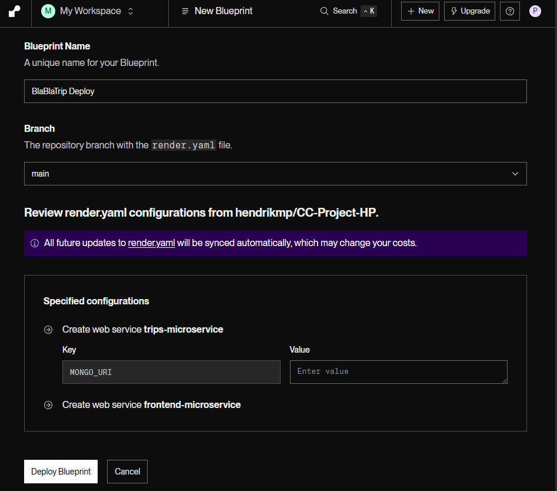
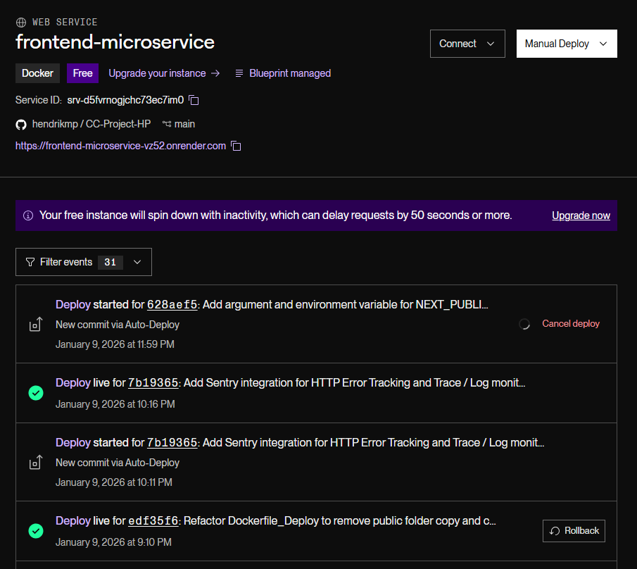
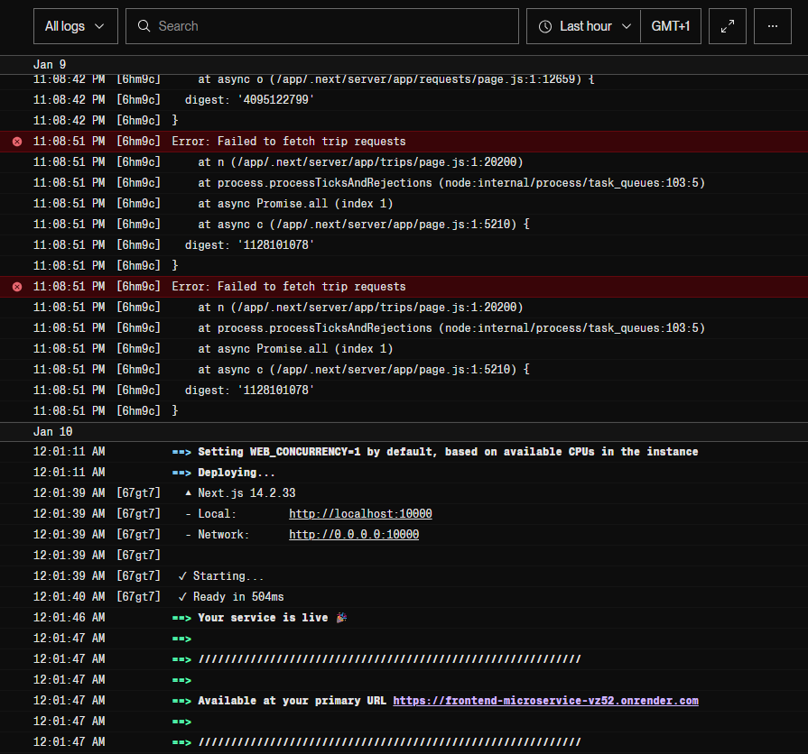
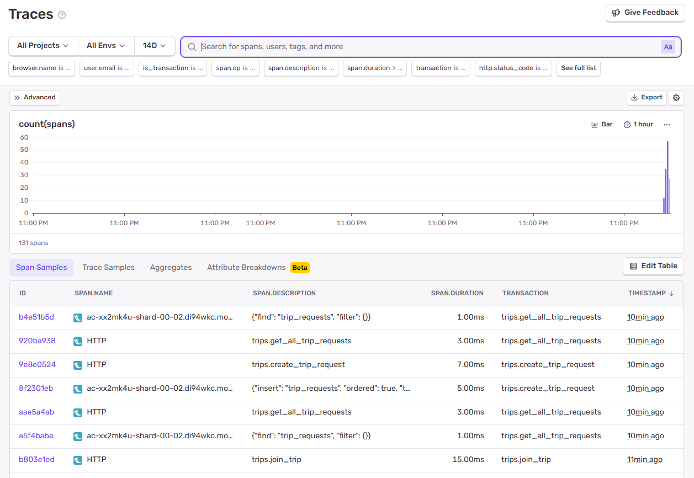
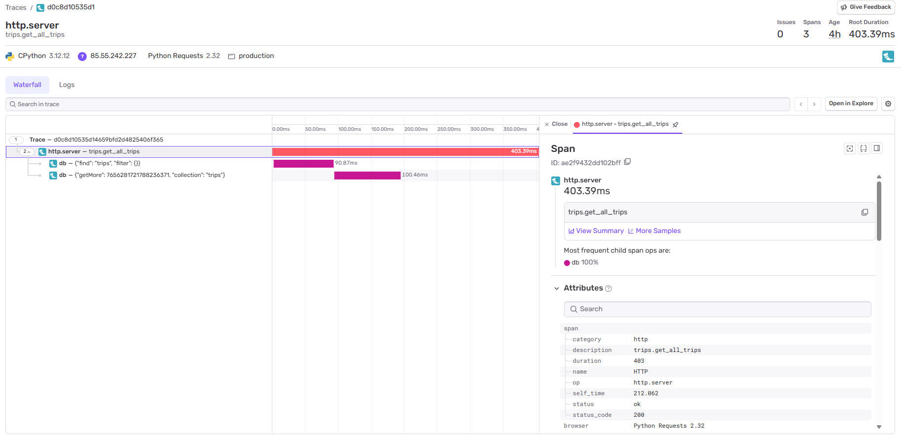
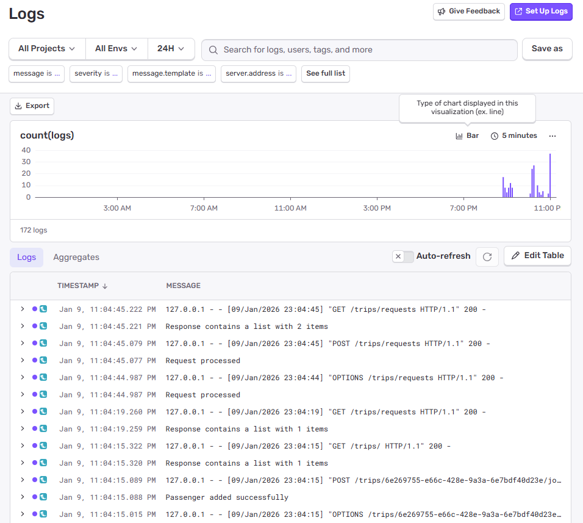
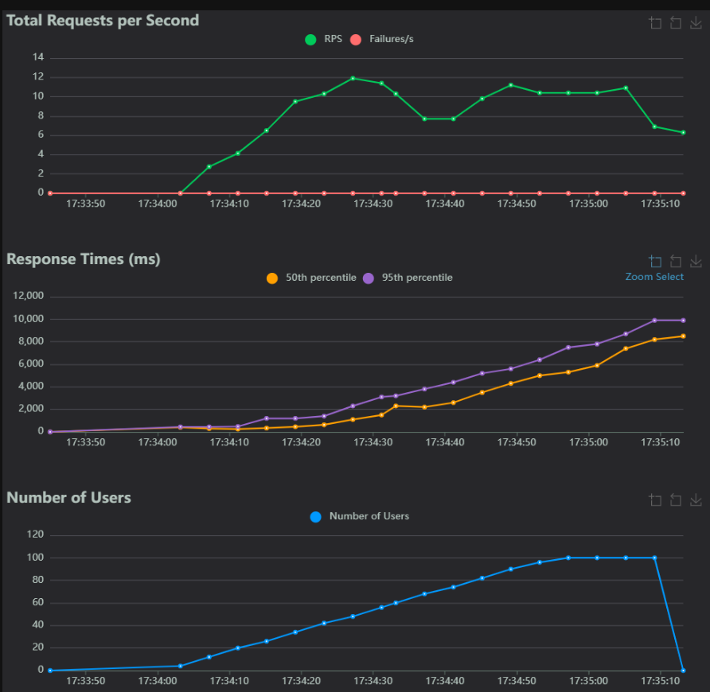

# Milestone 5 – Application Deployment on an IaaS or PaaS

Project: BlaBlaTrip – Do Trips Together With Strangers  
Student: Hendrik Pauthner  
Email: pauthner@campus.tu-berlin.de  
Course: Cloud Computing: Fundamentos e Infraestructuras - 25/26

## 1. Milestone Goals
- Determination of suitable criteria for choosing an IaaS/PaaS platform as well as evaluation of different options
- Selection and justification of the IaaS/PaaS platform and tools used for deployment
- Automatic deployment of the application to the IaaS/PaaS platform from the GitHub repository
- Fuctioning deployment on the IaaS/PaaS platform (verifying not only the status but also correct functioning)
- Implementation of observability tools to monitor the deployed application in real-time (performance metrics, events, logs, and traces)
- Conducting load and latency tests of the application deployed on the IaaS/PaaS platform

## 2. Choice of IaaS/PaaS Platform

### Criteria for Choosing a Suitable IaaS/PaaS Platform

The following are considered important criteria for choosing a suitable IaaS/PaaS platform:

1. **Cost:** The goal of this milestone is to find a deployment solution that either offers a completely free tier or has at least a free introductory phase, offering sufficient time to deploy and finalize the project.
2. **Available Hardware / Performance:** Every free tier of the different IaaS/PaaS providers comes with significant limitations regarding Hardware Resources provided (especially RAM and CPU). The goal is to find an option that offers enough resources for BlaBlaTrip to run with reasonable performance, at least with low to medium traffic load.
3. **Integrated Observability**: Does the solution offer integrated observability features that make it easier and faster to get the demanded information (performance metrics, events, logs, and traces)?
4. **Configuration**: How does configuration work in general and how complex is it?

### Selection of PaaS/IaaS Platform

For further investigation, two platforms have been considered - one is IaaS and the other PaaS:

1. **AWS (IaaS)**
2. **Render (PaaS)**

A detailed comparison based on the criteria is shown in the following table:

| **Criteria** | **Option A: AWS**  | **Option B: Render** |
| ------------------------------------ | -------------------------------------------------------------------------------------------------------------------------------------------------------------------------------------------------------------------------------------------------------------------------------------------------------------------------------------------------- | ---------------------------------------------------------------------------------------------------------------------------------------------------------------------------------------------------------------------------------------------------------------------------------------------------------------------- |
| **Cost** | Has a free tier for 12 months upon registration, offering one `t2.micro` or `t3.micro` EC2 instance for free.                                                                                                                                                                                                                                      | Has an indefinite free tier, in which the deployed Services automatically shut down after 15 minutes without active use.<br>Render grants **750 Free instance hours** to each workspace per calendar month.                                                                                                            |
| **Available Hardware / Performance** | The offered EC2 instance comes with **1GB of RAM**. This is probably not enough for the whole application (Frontend, one or possibly more backend services, database(s)).<br>Several instances could be deployed, which would make the configuration significantly more complex.                                                                   | The free tier gives you **512 MB of RAM per Service**. This amount can easily still be a problematic bottleneck if the services aren't lightweight.                                                                                                                                    |
| **Integrated Observability** | Extensive Observability available with AWS CloudWatch, but is not automatically automatically integrated and has to be configured individually.                                                                                                                                                                                                       | Events, Logs, and Network Metrics automatically integrated. CPU/RAM metrics unfortunately only for the paid version.                                                                                                                                                                                                   |
| **Configuration** | Complex: as AWS is IaaS, everything has to be deployed e.g., via Terraform. VM configuration, Firewall, Connectivity, etc. have to be configured on one's own.<br><br>Automatic Deployment from GitHub can be done with a GitHub Actions workflow.                                                                                                 | Simple: Deployment is done by the configuration file `render.yaml`. Render is PaaS, meaning that no effort is required to setup the underlying resources correctly.<br><br>Automatic Deployment from GitHub is activated by default without the need for configuration.                                                |
|                                      |                                                                                                                                                                                                                                                                                                                                                    |                                                                                                                                                                                                                                                                                                                        |
|                                      |                                                                                                                                                                                                                                                                                                                                                    |                                                                                                                                                                                                                                                                                                                        |

Ultimately, **Render** has been chosen as the deployment platform due to its indefinite free tier, the option to have several Services set up with 512MB of RAM without complex configuration, and the ease of configuration in general.

As a further improvement, instead of deploying the DB on Render, the MongoDB Database of the Trips Microservice will be "outsourced" and **deployed to MongoDB Atlas**, which offers a free tier to deploy MongoDB Databases without charge. This ensures that the Trips Microservice doesn't run out of RAM. Although this is SaaS and not PaaS, it is considered valid for this milestone, as the main part of the application remains deployed on PaaS. This step was taken solely to keep the deployment functional and free of charge.

## 3. Process of Deployment

The following section contains a step-by-step setup process for the SaaS platform for the backend database, Render as the PaaS Platform as well as the automatic deployment from the GitHub Repository.

### CloudDB Atlas

1. Create Account on MongoDB Atlas: https://www.mongodb.com/cloud/atlas/register
2. Create Project *BlaBlaTrip*
3. Create Cluster *BlaBlaTripDB*
	1. Select free tier
	2. Create User 
	3. Add 0.0.0.0/0 to the allowed IP list 
	4. Copy and Save the MongoDB Atlas connection string for the next Render Configuration 

## Render

1. Create a `render.yaml` file in the project root of the GitHub repo and push it:
   ```yaml
   services:
     # --- Trips Service ---
     - type: web
       name: trips-microservice
       runtime: docker
       region: frankfurt  
       plan: free
       dockerfilePath: ./trips/Dockerfile
       dockerContext: ./trips
       envVars:
         - key: PORT
           value: 5003
         - key: MONGO_URI
           sync: false              

     # --- Frontend Service ---
     - type: web
       name: frontend-microservice
       runtime: docker
       region: frankfurt
       plan: free
       dockerfilePath: ./frontend/Dockerfile_Deploy
       dockerContext: ./frontend
       envVars:
         - key: NEXT_PUBLIC_API_URL
           fromService:
             type: web
             name: trips-microservice
             envVarKey: RENDER_EXTERNAL_URL
         - key: INTERNAL_API_URL
           fromService:
             type: web
             name: trips-microservice
             envVarKey: RENDER_EXTERNAL_URL
   ```
   
   It defines all necessary information for the deployment to work. Note that `MONGO_URI`, `NEXT_PUBLIC_API_URL` and `INTERNAL_API_URL` have to be defined in the Render Dashboard throughout the deployment process.

2. Create Account on https://render.com/
   
3. **Create Blueprint:**
    1. Log in to https://render.com/
    2. In the left-hand menu, go to **Blueprints** $\rightarrow$ *+ New Blueprint Instance* --> 
    3. Choose a name *BlaBlaTrip Deploy*
    4. Connect your GitHub repository
    5. Paste the `MONGO_URI` connection string from the MongoDB Atlas configuration 
    
       
4. After connecting to the GitHub repo, automatic Deployment from GitHub is activated by default without the need for additional configuration.

5. **Deploy:**
    - Click **Apply**.
    - Watch the logs window. It logs the building process of the Docker containers.
      

## 4. Correct Operation of Deployment

The correct deployment of the application in general, and the different services specifically, can be checked in the Render dashboard by navigating to:

Blueprints (left menu) -> *BlaBlaTrip Deploy* -> selecting *frontend-* / *trips-microservice* -> Events (left menu)

There you will find the deployment events of the corresponding Microservices (successful deployments and failures). The following picture shows the events of the Frontend Microservice:




The deployed BlaBlaTrip Website (visible in the top part of the Render dashboard) is now accessible via the URL given by Render: https://frontend-microservice-vz52.onrender.com.

## 5. Observability

To monitor the deployed application in real time, use has been made of the integrated observability tools from Render as well as [Sentry](https://sentry.io) for Traces and Logs.

### Render

As shown at the end of the previous section, Render provides means to monitor deployment **events**.

Furthermore, it also features integrated **logs**, an example of which is shown for the Trips Microservice below:



Finally, Render provides **metrics** as well. Unfortunately, CPU and RAM usage metrics are only available in the paid version, so they are omitted here. In the free version, only Network metrics in the form of outbound bandwidth are provided, as shown below:


### Sentry

To extend monitoring capabilities, Sentry was installed alongside the Backend (Trips Microservice).

It is capable of tracking HTTP Errors, Logs, Metrics, and custom user-defined metrics, among others. The results are presented within the Sentry Dashboard, which provides query options and visual rendering for faster navigation.

The following two images show the view of all Traces, followed by the view of one specific Trace:




Additionally, an example screenshot of the Trips Microservice logs view can be examined below:



## 6. Load and Latency Test

For conducting Load and Latency Tests for the deployed application, [Locust](https://locust.io/) was chosen as the framework.

It allows for specifying realistic user behavior, where users make API calls against the backend.

The test is simply defined by a python file. In this case, the following test definition has been used and saved as `locustfile.py`:

```python
from locust import HttpUser, task, between
from uuid import uuid4

class ViewerUser(HttpUser):
    # Wait between 1 and 3 seconds between tasks (simulates real human behavior)
    wait_time = between(1, 3)

    @task(1)
    def view_trips(self):
        """Simulates a user loading the main page (GET request)"""
        self.client.get("/trips")
        self.client.get("/trips/requests")

class CreatorUser(HttpUser):
    wait_time = between(5, 10)
    
    @task(2)
    def create_trip(self):
        """Simulates a user creating a trip (POST request)"""
        # Sending random data to avoid "duplicate" errors if your backend checks
        payload = {
            "capacity": 1,
            "cost_per_passenger": 0,
            "destination": "test",
            "driver_car": "test",
            "driver_id": str(uuid4()),
            "pickup_location": "test",
            "return_datetime": "2026-01-11T16:00:21.335Z",
            "start_datetime": "2026-01-10T16:00:21.335Z"
            }
        
        # Note: We assume your backend route is /trips based on previous chats
        # Adjust the URL string if your route is different
        self.client.post("/trips", json=payload)

    @task(1)
    def create_trip_request(self):
        """Simulates a user creating a trip request (POST request)"""
        # Sending random data to avoid "duplicate" errors if your backend checks
        payload = {
            "destination": "test",
            "earliest_start_date": "2026-01-10T16:31:20.768Z",
            "latest_start_date": "2026-01-11T16:31:20.768Z",
            "passenger_id": str(uuid4())
        }
        
        # Note: We assume your backend route is /trips/requests based on previous chats
        # Adjust the URL string if your route is different
        self.client.post("/trips/requests", json=payload)
```

It defines two Users:
1. **ViewerUser**: Invokes API calls to get Trips and Trip Requests.
2. **CreatorUser**: Invokes API calls to create Trips and Trip Requests.

The file is meant to be saved locally and executed locally, but is also has been added to the root of the repository for reproducability. 

After installing Locust with pip, it is then started from the command line with:
```bash
locust
```

It launches a web interface at http://0.0.0.0:8089, in which the load test can be conducted.

It asks for 3 parameters:
- Maximum number of created users => 100
- Increase of Users every second (until maximum is reached) => 3
- URL to test against => https://trips-microservice.onrender.com

The results can be seen in the following image:



**Interpretation:**

At 48 users, the appication is able to serve 12 RPS (Requests per second) with a mean latency 1.300ms = 1,3 seconds, which is still somewhat exeptable.

With further incriesing numer of users the application reaches a tippoing point and breaks, that is the RPS number goes down while the Response times increase to an unacceptable level.